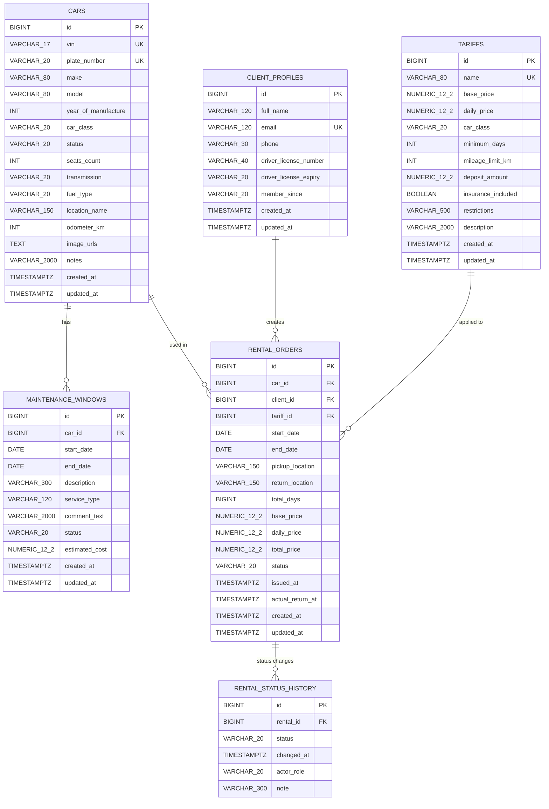

# Схема БД (Car Rental)

Ниже приведена актуальная схема БД по текущим JPA-сущностям backend.

## ER-диаграмма (Mermaid)



## Enum-значения

- `cars.car_class`: `ECONOMY`, `COMFORT`, `BUSINESS`, `SUV`, `PREMIUM`
- `cars.status`: `AVAILABLE`, `RENTED`, `MAINTENANCE`, `INACTIVE`
- `cars.transmission`: `AUTOMATIC`, `MANUAL`
- `cars.fuel_type`: `PETROL`, `DIESEL`, `ELECTRIC`, `HYBRID`
- `maintenance_windows.status`: `SCHEDULED`, `IN_PROGRESS`, `COMPLETED`
- `rental_orders.status`: `CREATED`, `CONFIRMED`, `ISSUED`, `COMPLETED`, `CANCELLED`
- `rental_status_history.status`: `CREATED`, `CONFIRMED`, `ISSUED`, `COMPLETED`, `CANCELLED`
- `rental_status_history.actor_role`: `CLIENT`, `FLEET_MANAGER`

## PostgreSQL DDL (референсная версия)

```sql
create table if not exists cars (
    id bigserial primary key,
    vin varchar(17) not null unique,
    plate_number varchar(20) not null unique,
    make varchar(80),
    model varchar(80),
    year_of_manufacture integer,
    car_class varchar(20) not null,
    status varchar(20) not null,
    seats_count integer,
    transmission varchar(20),
    fuel_type varchar(20),
    location_name varchar(150),
    odometer_km integer,
    image_urls text,
    notes varchar(2000),
    created_at timestamptz not null,
    updated_at timestamptz not null
);

create table if not exists tariffs (
    id bigserial primary key,
    name varchar(80) not null unique,
    base_price numeric(12,2) not null,
    daily_price numeric(12,2) not null,
    car_class varchar(20),
    minimum_days integer,
    mileage_limit_km integer,
    deposit_amount numeric(12,2),
    insurance_included boolean,
    restrictions varchar(500) not null,
    description varchar(2000),
    created_at timestamptz not null,
    updated_at timestamptz not null
);

create table if not exists client_profiles (
    id bigserial primary key,
    full_name varchar(120) not null,
    email varchar(120) not null unique,
    phone varchar(30) not null,
    driver_license_number varchar(40),
    driver_license_expiry varchar(20),
    member_since varchar(20),
    created_at timestamptz not null,
    updated_at timestamptz not null
);

create table if not exists maintenance_windows (
    id bigserial primary key,
    car_id bigint not null references cars(id),
    start_date date not null,
    end_date date not null,
    description varchar(300) not null,
    service_type varchar(120),
    comment_text varchar(2000),
    status varchar(20),
    estimated_cost numeric(12,2),
    created_at timestamptz not null,
    updated_at timestamptz not null
);

create table if not exists rental_orders (
    id bigserial primary key,
    car_id bigint not null references cars(id),
    client_id bigint not null references client_profiles(id),
    tariff_id bigint not null references tariffs(id),
    start_date date not null,
    end_date date not null,
    pickup_location varchar(150),
    return_location varchar(150),
    total_days bigint,
    base_price numeric(12,2),
    daily_price numeric(12,2),
    total_price numeric(12,2) not null,
    status varchar(20) not null,
    issued_at timestamptz,
    actual_return_at timestamptz,
    created_at timestamptz not null,
    updated_at timestamptz not null
);

create table if not exists rental_status_history (
    id bigserial primary key,
    rental_id bigint not null references rental_orders(id),
    status varchar(20) not null,
    changed_at timestamptz not null,
    actor_role varchar(20),
    note varchar(300) not null
);

create index if not exists idx_maintenance_windows_car_dates
    on maintenance_windows (car_id, start_date, end_date);

create index if not exists idx_rental_orders_car_dates_status
    on rental_orders (car_id, start_date, end_date, status);

create index if not exists idx_rental_orders_client_id
    on rental_orders (client_id);

create index if not exists idx_rental_status_history_rental_changed
    on rental_status_history (rental_id, changed_at);
```

